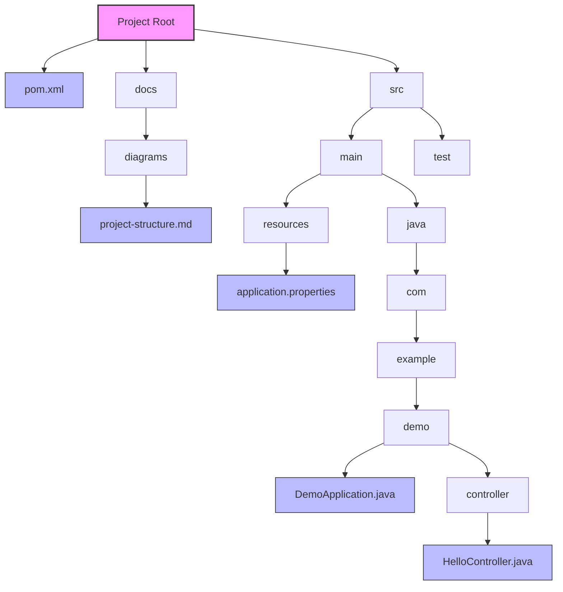

# Project Structure Diagram

## Directory Structure Explanation

- `docs/`: Documentation folder
  - `diagrams/`: Contains all project diagrams
    - `project-structure.md`: This file containing the project structure diagram

- `src/`: Source code directory
  - `main/`: Main application code
    - `java/`: Java source files
    - `resources/`: Configuration files
  - `test/`: Test code

- `pom.xml`: Maven configuration file 